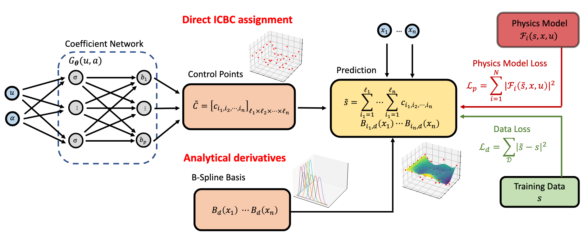

# PI-BSNet
Implementation of paper ["Physics-Informed Deep B-Spline Networks"](https://arxiv.org/abs/2503.16777), in Transactions on Machine Learning Research (TMLR).




## How to Run

Convection diffusion equations with baseline comparisons: `convection_diffusion.py`.

Burgers' equations: `burgers.ipynb`.

Advection equations: `advection.ipynb`


Diffusion equations on the trapezoid domain: `diffusion_trapezoid.ipynb`

Generalization error experiment on advection equations: `generalization_error.ipynb`

Neumann BC experiments: `neumann_bc.py`

Derivative calculation ablations: `derivatives_ablation.ipynb`


## Citation

```
@article{wang2025physics,
  title={Physics-Informed Deep B-Spline Networks},
  author={Wang, Zhuoyuan and Romagnoli, Raffaele and Mowlavi, Saviz and Nakahira, Yorie},
  journal={arXiv preprint arXiv:2503.16777},
  year={2025}
}
```


